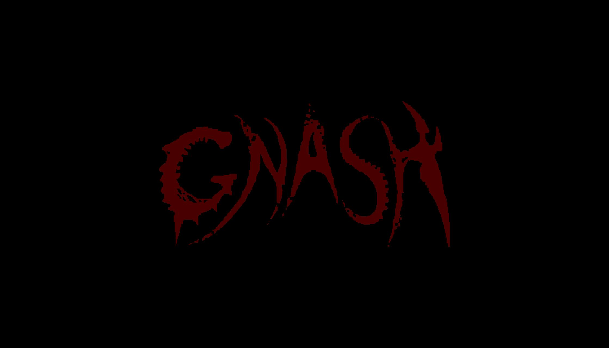

# Gnash - Coming to Steam... some day
An action-platformer being built in Unity. This is a passion project being made between a few friends/updated in free time for now, but we are open to colalborators!

## Features

The main focus of this project is to create a 2d platforming character controller that just feels fun to use, with lots of different quirks that make it stand out from your standard Celeste-wannabe controller.  Because of this, we are using a state machine for the character controller, so functionality can easily be added or taken away without breaking the whole system.
 
 
 
 

 
 
 
 